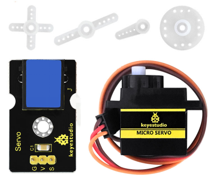
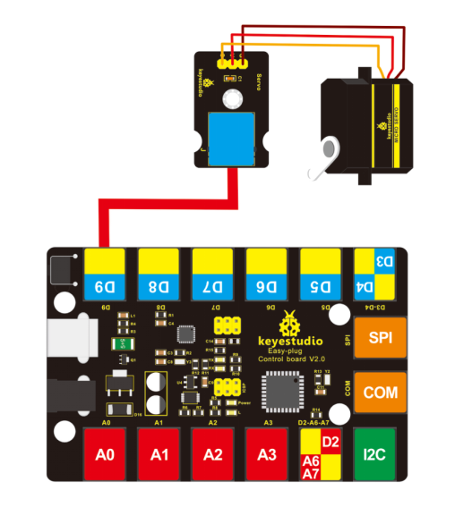
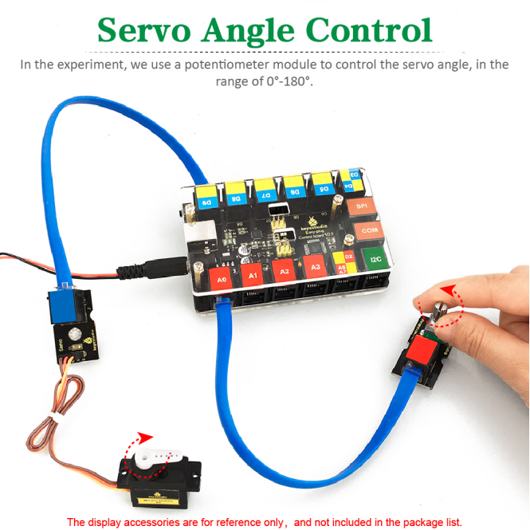

# KS0372 EASY plug Servo Module +Micro Servo



## 1. Introduction

If you want to use the Micro Servo and EASY PLUG control board to make experiments, you need to use the EASY plug Servo extension module.

Here comes EASY plug Servo module and a 180° Micro Servo together in the package.

**Package Includes:**

- EASY plug Servo Module *1
- Micro Servo *1

**Special Note:**

The sensor/module is equipped with the RJ11 6P6C interface, compatible with our keyestudio EASY plug Control Board with RJ11 6P6C interface.

If you have the control board of other brands, it is also equipped with the RJ11 6P6C interface but has different internal line sequence, can’t be used compatibly with our sensor/module.

The EASY plug Servo module is extended into Registered Jack, so you can connect it to EASY PLUG control board using only a RJ11 cable.

The Servo module also comes with 3pins of 2.54mm pin pitch, fully compatible with servo pins.

Servo motor comes with many specifications. But all of them have three connection wires, distinguished by brown, red, orange colors. Brown one is for ground, red one for power positive, orange one for signal line.

Included with your Micro Servo you will find a variety of white motor mounts that connect to the shaft of your servo.

You may choose to attach any mount you wish for the circuit. It will serve as a visual aid, making it easier to see the servo spin.

The rotation angle of Servo motor is controlled by regulating the duty cycle of PWM (Pulse-Width Modulation) signal. The standard cycle of PWM signal is 20ms (50Hz).

Theoretically, the width is distributed between 1ms-2ms, but in fact, it’s between 0.5ms -2.5ms. The width corresponds to the rotation angle from 0° to 180°.


## 2. Micro Servo Parameters

- Operating voltage: DC 4.8V〜6V
- Angle range: about 180°(in 500→2500μsec)
- Pulsewidth range: 500→2500μsec
- No-load speed: 0.12±0.01 sec/60（DC 4.8V）; 0.1±0.01 sec/60（DC 6V）
- No-load current: 200±20mA（DC 4.8V）; 220±20mA（DC 6V）
- Stop torque: 1.3±0.01kg/cm（DC 4.8V）; 1.5±0.1kg/cm（DC 6V）
- Stop current: ≦850mA（DC 4.8V）; ≦1000mA（DC 6V）
- Standby current: 3±1mA（DC 4.8V）; 4±1mA（DC 6V）
- Operation temperature: -10℃〜50℃
- Save temperature: -20℃〜60℃
- Motor wire length: 250 ± 5 mm

## 3. Connect It Up

Connect the EASY Plug servo module and micro servo to control board using an RJ11 cable.

Connect the servo motor to EASY Plug Servo module. Brown line is for ground, red one for V pin, orange one for signal pin.

Then connect the control board to your PC with a USB cable.



## 4. Upload the Code

Download code :  [Code](./Code.7z)

```c
int servopin=9;// define digital 9 connected to servo signal line
int myangle;// define the angle variable
int pulsewidth;// define the pulsewidth
int val;

void setup()
{
    pinMode(servopin,OUTPUT);// set the servo to OUTPUT
    Serial.begin(9600);// connect to serial port, baud rate to 9600
    Serial.println("servo=o_seral_simple ready" );
    servopulse(servopin,90);// call the pulse function, servo rotates to 90 degrees
} 

void loop()
{
  servopulse(servopin,90);//call the pulse function, servo rotates to 90 degrees
}

void servopulse(int servopin,int myangle)// define the pulse function
{
    pulsewidth=(myangle*11)+500;// convert the angle into pulsewidth of 500-2480
    digitalWrite(servopin,HIGH);// set the servo pin to HIGH 
    delayMicroseconds(pulsewidth);// delay the microsecond of pulsewidth 
    digitalWrite(servopin,LOW);// set the servo pin to LOW
    delay(20-pulsewidth/1000);
}	
```

## 5. Result

After uploading the code, press down the reset button on the control board, servo will rotate to 90 degrees. You can set the angle within 0-180° in the test code **servopulse(servopin,90)**. Or you are able to add a potentiometer sensor to observe the rotation. 

 

